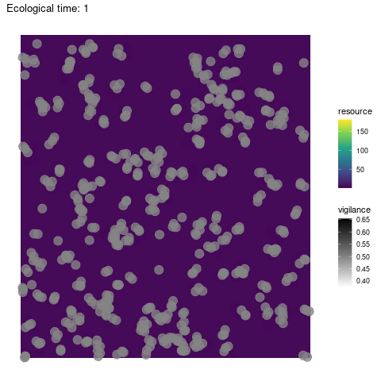
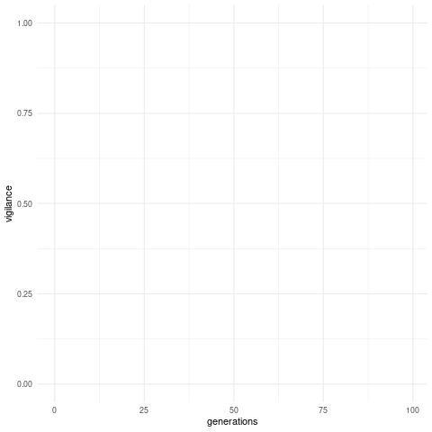

# coding-challenge-hanno
Coding challenge assigned by Hanno Hildenbrandt for a programmer position at RUG (Python version).

## Testing
This program is developped through Test-Driven Development ([TDD](https://en.wikipedia.org/wiki/Test-driven_development)). Tests are run locally and on Travis CI for the main branch and the develop branch. When tests are all passing, you see a green `passing` badge in the table below, otherwise you see a red `failing` badge. Click on the badge for details. The percentage of the code that is covered by tests is assessed with CodeCov and indicated in the table below. Click on it for coverage statistics, details and graphs.

Branch|Travis|CodeCov
---|---|---
master|[](https://www.travis-ci.com/ClaireGuerin/coding-challenge-hanno)|[](https://codecov.io/gh/ClaireGuerin/coding-challenge-hanno)
develop|[](https://www.travis-ci.com/ClaireGuerin/coding-challenge-hanno)|[](https://codecov.io/gh/ClaireGuerin/coding-challenge-hanno)

## Visual

Exploration                  | Trait evolution
:---------------------------:|:----------------------------:
 | 

## Model description

In this model, a population of prey roams around and collects resources from a bounded ecosystem. The ecosystem is a squared grid of a defined size. Predation risk is constant and diffused over the whole grid. Over a specific amount of time steps, an individual will repeat a routine as follows:

1. move on the ecosystem grid by one step, that is to say to a neighbouring grid cell. The destination cell is chosen randomly from the neighbouring cells (including the origin cell: the individual can stay on the same cell over one time step).
2. gather resources within their current cell, and add them to their storage. Let us consider there is a total of R resources in the cell at the time. When there are several individuals in the cell, they share the resources fairly as follows:


Where alpha is the gathering efficiency, n is the number of individuals in the cell, gamma is the competition level and v is the individual's vigilance level against predation. Vigilance is an evolving trait subject to mutation and natural selection, and is continuous (from 0 to 1). Kin selection being virtually inexistant in this model, and the sharing of resources representing a form of public good game, one could expect vigilance to tend to zero over time. However, vigilance is also under positive selection as it increases an individual's chances of survival.

3. the individual dies due to predation or survives to the next time step. The predation risk p is constant, and is defined by the probability for a prey to be eaten by a predator, in absence of vigilance. An individual's vigilance mitigates this risk, so that the probability to die at this time step is:


Resources in a cell grow at each time step at a growth rate r. If the cell was unoccupied and resources conserved, the amount of resources in the cell at the next time step is R x r. Otherwise, it is:


Cell resources cannot grow indefinitely: when the cell becomes overfull, a resources crash is triggered, leading the resources to go back to their initial amount. This can be thought of as a population collapse at the resource level, due to disease for instance.

After a number of time steps (user-defined), the individuals who survived reproduce according the resources they managed to store. The more resources in their storage, the higher their fertility. The number of offpsring produced by an individual follows a Poisson distribution where fertility is the mean. The next generation is produced following a Moran process: all offspring go into a pool, from which a fixed number of individuals is randomly selected to form the new generation. Offspring inherit their parents' vigilance level (subject to mutation), and start off on the grid cell where their parents were during reproduction. Generations are non-overlapping: all parents die after reproduction. As a result, the population size at the beginning of each life cycle is always the same. It may decrease over time until reproduction, due to predation. In the event where all individuals of a generation were to die from predation, the population goes extinct and the simulation stops.

## Installation

Simply download this repository and place wherever convenient on your machine.

## Requirements
This code was developped under Linux (Ubuntu 20.04.2 LTS) under Python 3.7.3, and requires SciPy. To install Python, follow [these guidelines](https://docs.python-guide.org/starting/install3/linux/). To install the SciPy package on Ubuntu, run `python -m pip install --user scipy`.

For visual output (`dev='on'`), download [this R code](https://github.com/ClaireGuerin/anim-vigil). Rust and xdg-utils are required. To install on Ubuntu, run
```shell
sudo apt-get update -y
apt-get install cargo
apt-get install -y xdg-utils
```

## Usage

Run simulation with command line `python run.py` or `python run.py on` for visuals. Depending on how python is set up on your machine, you might need to type `python3` instead of `python`. For more flexibility:

```python
from model.population import Population as Pop

pop = Pop(par="my/custom/path.txt", v=0.2) # Give custom path to parameters file with par (default:"parameters.txt"). Set initial level of vigilance in population with v (default: 0.5). 
pop.create()
pop.launch(dev='on') # turn visualisation on/off with dev. 
```

The program will create an output folder to store:
- output text files with vigilance means over generation times (`vigilance_out.txt`), resources change (`resources_out.txt`) and individual movement (`exploration_out.txt`) over ecological time.
- animated visualisations of the evolution of vigilance (`vigilance_out.gif`) and individual movement and resources on the grid (`grid_out.txt`).

### Parameters
Change parameter values in `parameters.txt`.

> `gridSize` the length of one square ecosystem grid side, e.g. `10`.
> 
> `nIndiv` the number of individuals at the beginning of each generation, e.g. `20`.
> 
> `nGen` the number of generations to run the simulation for, e.g. `300`.
> 
> `routineSteps` the number of time steps in the life cycle before reproduction, e.g. `4`.
> 
> `mutRate` the mutation rate, e.g. `0.01`.
> 
> `mutStep` the mutation step (variance), e.g. `0.005`.
> 
> `initRes` the initial amount of resources in each cell on the ecosystem grid, e.g. `1.0`.
> 
> `efficiency` the gathering efficiency of resources by preys (alpha), e.g. `0.8`.
> 
> `predation` the basal predation rate in the absence of vigilance, e.g. `0.3`.
> 
> `competition` the competition level for shared resources (gamma), e.g. `2.1`.
> 
> `growth` the resources natural growth rate (r), e.g. `1.2`.
> 
> `fecundity` the individual fecundity, e.g. `1.5`.

## Roadmap

The next immediate challenge is to synchronise the grid visual (ecological time) and the vigilance level figure (generation time). A full GUI would eventually be useful. In later steps, testing for compatibility with other OS and distros would be ideal.

## Contributing
Pull requests are welcome. For major changes, please open an issue first to discuss what you would like to change.
Please make sure to update and write tests for each contribution using pytest, and to place them in the test folder. Run tests locally with `python -m pytest`. Note that this code is also tested remotely on Travis CI.

## Authors and acknowledgements
General description of the model by Hanno Hildenbrandt.
Equations and code by Claire Guerin.
Thanks to Raphaël Scherrer for trying the programme on his machine.

## License

[GPL-3.0](https://github.com/ClaireGuerin/coding-challenge-hanno/blob/main/LICENSE)

